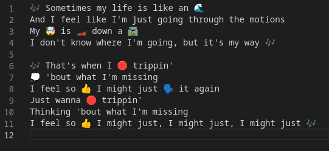
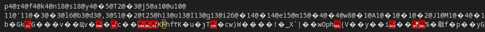

# ANTMAN
The Antman is a C algorithmic project that was done in groups of two over a period of three weeks. 
The goal is to compress and decompress a file with lossless compression. 
The program takes text files, html files (.html) and images (.ppm). 

---
## Installation and usage

To use it, follow the instructions below: 
- Clone the repository by entering the following command in your terminal:

        git clone git@github.com:nathanbaudelin/Antman.git

- Once inside the cloned folder, compile the project by entering the command:

        make re

- Run the program by entering these commands:

    - In order to compress a file, you need to run the program with this command:

            ./antman/antman file.txt [1-3]

            file.txt        file to compress
            [1-3]           type of file (1: text, 2: html, 3: image)

    - In order decompress a file, you need to run the program with this command:

            ./giantman/giantman compressed.txt [1-3]

            compressed.txt  file to decompressed
            [1-3]           type of file (1: text, 2: html, 3: image)

#### Example
I have a text file:

I want to compressed this file (and redirect the result in a file for decompress it). I must type the command:

        ./antman/antman file_test/test.txt 1 > compressed.txt

In the compressed.txt file we get:

After that, I want to decompress the compressed file (and redirect the result in a file). I must type the command:

        ./giantman/giantman compressed.txt 1 > uncompressed.txt

The result will be:

You have many files in the file_test folder.

---

## Contributors

[Nathan Baudelin](https://github.com/nathanbaudelin) 
[Pierre Giordano](https://github.com/giordano-pierre)
